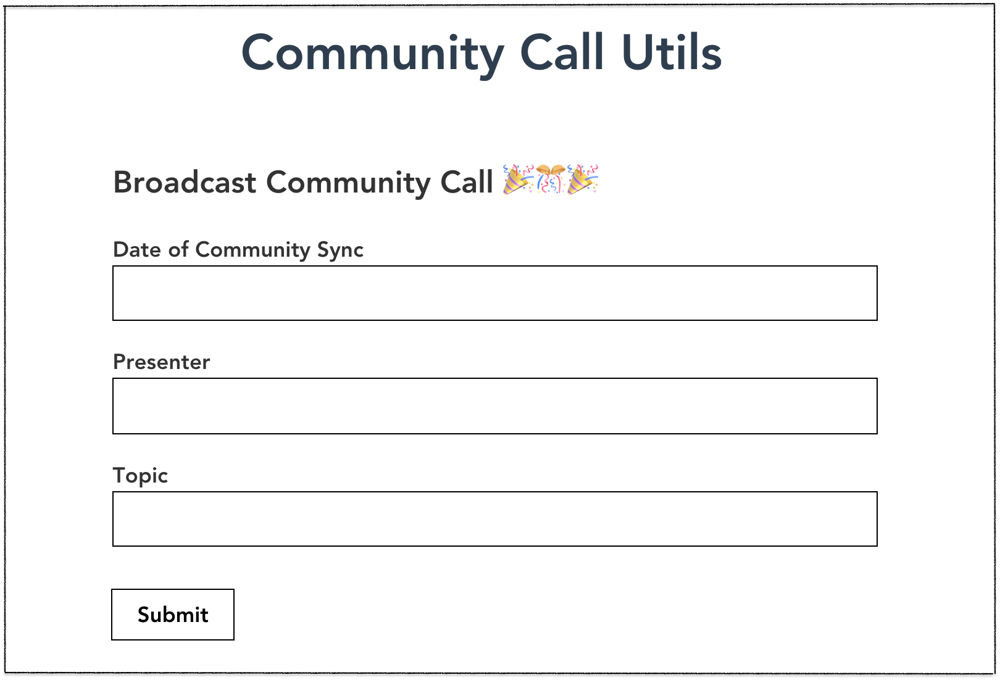

# Community Call Helper 🤖 📅 ⚡️
---

### Purpose:

Organizing community syncs can be tedious! The Community Sprint Helper is a collection of tools that makes it easier to schedule community syncs and to manage community sync notes. 

## Current Feature

* Schedule a Community Sync Up via Github Issues



#### Schedule Community Sync Up Installation

1. `git clone` https://github.com/ipfs/community-call-helper
2. `cd app`
3. `npm install`
4. Go to [Developer Settings](https://github.com/settings/developers) and get your _Personal Access tokens_.
5. Put your token in `config.json`

```
    {
        "token": ""
    }
```
6. Go back to the command line and enter `npm run serve`
7. Access the site via localhost:8080

#### Customization

```
Endeavour      | Moderator            | Notetaker | Time (PST - UTC - CET) | Pad
:------------: | :-------------: | :-------: | :--------------------: | :----:
All Hands Call | @pkafei    | TBD  | 9:00 **17:00** 18:00  | [agenda and notes](https://docs.google.com/document/d/1WHyIZhBo2eEgYXlZ5HLHg6a6ZWTH3tV848sWkYBJjJA/edit)
```

Right now the default sync up in the markdown table is the All Hands On Call. In order to customize the table to your community sync up go to [HomePage.vue]("src/components/HomePage.vue") and change the following:

* Endeavor
* Moderator
* Notetaker 
* Pad
* Zoom link

In the future you will be able to change these columns in the UI.


## Future Features

* Announcement bar on IPFS website _coming soon_

* Make the markdown customizable

* Format notes

* Compatibility with [Peer Pad](https://github.com/ipfs-shipyard/peer-pad)

* Create PR for Community Sync Nots